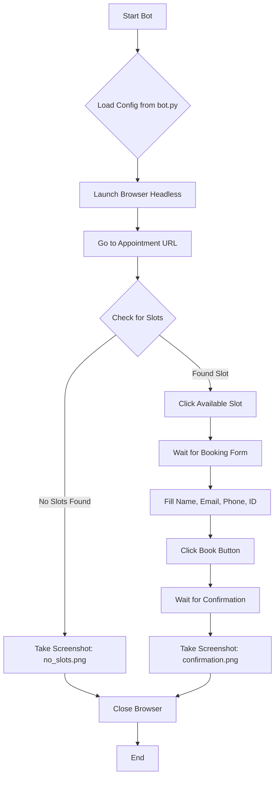

# Auto Booking Bot for Google Calendar Appointments

This bot automatically checks for available appointment slots on a specific Google Calendar Schedule and books them with your details.

## Features
-   **Automated Booking**: Checks for slots and books immediately.
-   **Form Filling**: Automatically fills in Name, Email, Phone, and Student ID.
-   **Scheduled Run**: Can run on a schedule (e.g., every 15 minutes) using GitHub Actions (Free).
-   **Headless Mode**: Runs in the background without opening a browser window.

## How it Works (Flow Diagram)



## Prerequisites
-   Python 3.8+
-   A GitHub account (for free cloud hosting/running)

## Setup Guide

### Option 1: Run Locally (On your computer)

1.  **Install Dependencies**
    Open your terminal/command prompt in this folder and run:
    ```bash
    pip install -r requirements.txt
    playwright install chromium
    ```

2.  **Configure Your Details**
    The project includes a file named `.env` for your configuration. Open it and edit your details:
    ```env
    FIRST_NAME=นายสมชาย
    LAST_NAME=รักเรียน
    EMAIL=somchai@example.com
    PHONE=0812345678
    STUDENT_ID=6612345678
    # TARGET_URL=... (Optional, only if the link changes)
    ```

3.  **Run the Bot**
    ```bash
    python bot.py
    ```
    The bot will open the browser (hidden), check for slots, and book if available. Check `confirmation.png` or `error.png` for results.

---

### Option 2: Run on GitHub Actions (Free & Automatic)

This option allows the bot to run automatically in the cloud without your computer being on.

1.  **Upload to GitHub**
    -   Create a new repository on GitHub.
    -   Push this code to the repository.

2.  **Set up Secrets (Securely store your info)**
    -   Go to your GitHub Repository > **Settings** > **Secrets and variables** > **Actions**.
    -   Click **New repository secret**.
    -   Add the following secrets (matches the `.env` variables):
        -   `FIRST_NAME`
        -   `LAST_NAME`
        -   `EMAIL`
        -   `PHONE`
        -   `STUDENT_ID`

3.  **Enable the Workflow**
    -   Go to the **Actions** tab in your repository.
    -   Select **Auto Booking Bot** on the left.
    -   Click **Run workflow** to test it immediately.
    -   The bot is also configured to run automatically every 15 minutes (see `.github/workflows/booking.yml`).

## Customization
-   **Change Frequency**: Edit `.github/workflows/booking.yml` and change the `cron` schedule.
    -   `*/15 * * * *` = Every 15 minutes.
    -   `0 9 * * *` = Every day at 9:00 AM UTC.
-   **Target URL**: Edit `bot.py` and change the `TARGET_URL` variable if the booking link changes.

## Troubleshooting
-   **No slots found**: The bot takes a screenshot (`no_slots.png` locally, or in Artifacts on GitHub) if it can't find a button to click.
-   **Selectors failing**: If Google changes the form layout, update the `get_by_label` lines in `bot.py`.
