# 🧪 Experimental Browser Automation: Booking System Study

This repository contains a research prototype for an automated booking bot, built using **Python** and **Playwright**. 

## 🎯 Project Objective
The primary goal of this project was **not** to build a functional product, but to **experiment with browser automation techniques** against modern, high-security web applications.

We aimed to understand:
1.  How modern web apps handle automated interactions.
2.  The effectiveness of "Stealth" browser configurations.
3.  The complexity of simulating human-like input (mouse movements, clicks, focus events).

## 🔬 Case Study: Google Calendar Appointment Schedules
We selected **Google Calendar Appointment Schedules** as our test target because it represents one of the most secure and sophisticated booking interfaces on the web.

### 📊 Experiment Results
-   **✅ Success**: The bot successfully navigates to the target URL in headless mode with stealth configurations.
-   **✅ Success**: The bot correctly parses the DOM to identify available time slots (handling dynamic loading).
-   **✅ Success**: The bot initiates the booking process by clicking the slot.
-   **✅ Success**: The bot accurately fills out the booking form (Name, Email, Student ID) supporting multi-language labels (Thai/English).
-   **❌ Failure**: The final "Book" / "Confirm" action fails.
    -   **Reason**: Google's security measures likely employ advanced **behavioral biometrics** (analyzing mouse velocity, acceleration, micro-movements, and timing between events) or backend verification that detects the Playwright execution context. Even with `dispatchEvent` and `force=True` clicks, the system rejects the final request.

## 🔮 Potential Applications & Viability

While this specific experiment failed to conquer Google's top-tier security, the foundational code is **highly effective** for general-purpose automation.

### Where this bot *would* likely succeed:
1.  **University/Library Booking Systems**: Often standard web forms without advanced bot protection.
2.  **Government Queue Reservartions**: Typically basic HTML forms checking only for completed fields.
3.  **Local Clinic/Service Sites**: Websites that use standard CMS plugins for booking.
4.  **Internal Corporate Tools**: Employee portals for meeting room reservations.

### Why?
Most general booking sites only validate:
-   ✅ Is the button clicked?
-   ✅ Is the form data valid?
-   ✅ Is the session cookie active?
*(They rarely check mouse velocity or micro-behavior like Google does.)*

This bot's architecture—scanning for keywords, handling dynamic loading, and filling forms robustly—makes it a **powerful template** for automating 80-90% of booking tasks on the open web.
## 🛡️ Impact of DDoS Protection & WAF (Web Application Firewalls)

Will standard DDoS protection stop this bot? **It depends.**

### 1. Rate Limiting (DoS)
-   **Impact: Low** 🟢
-   This bot simulates **one single user** clicking through a website at human speed. It does **not** flood the server with thousands of requests per second. Therefore, standard rate-limiting rules usually ignore it.

### 2. Cloudflare / WAF Challenges
-   **Impact: Medium** 🟡
-   Modern WAFs (like Cloudflare) check "Is this a real browser?".
-   **Our Defense**: The bot uses `stealth` context and realistic User-Agents. It can often pass standard WAF checks because it executes JavaScript correctly.
-   **Why Google Calendar Failed**: Google goes deeper than a standard WAF. It doesn't just check "Is this a browser?", it checks "**Is this a human?**". It analyzes:
    -   **Mouse Trajectory**: Humans don't move mice in perfect straight lines.
    -   **Event Timing**: Humans have variable reaction times (entropy), bots are too consistent.
    -   **Account Trust**: A headless login from a datacenter IP (GitHub Actions) on a consumer account is highly suspicious.

### 3. CAPTCHA (Recaptcha / Turnstile)
-   **Impact: High** 🔴
-   If the booking flow requires solving a puzzle (Pick the traffic lights), this bot **will fail**.
-   **Workaround**: Some CAPTCHAs can be solved using 3rd party APIs (2Captcha, etc.), but that is outside the scope of this research.
## 🛠️ Technical Implementation

### Technologies
-   **Python 3.8+**
-   **Playwright** (Async API)
-   **Regular Expressions** (for robust text matching)

### Advanced Techniques Attempted
To bypass standard bot detection, we implemented:
1.  **Stealth Context**:
    -   Removed `navigator.webdriver` flags to hide automation indicators.
    -   Spoofed `User-Agent` to match a real macOS machine.
    -   Configured realistic Viewport resolution and device scale factor.
2.  **Hybrid Interaction Strategy**:
    -   Instead of simple `.click()`, we injected JavaScript to dispatch specific events: `pointerdown`, `mousedown`, `pointerup`, `mouseup`.
    -   We attempted to simulate "hover" and "focus" states before interaction to mimic human behavior.
3.  **Selector Robustness**:
    -   Used broad logic to find buttons by Role, Text, Class, and specific attributes (`jsname`, `aria-label`).
    -   Implemented fallback search strategies (if Strategy A fails, try B, then C).

## ⚠️ Disclaimer
This code is for **educational and research purposes only**. It demonstrates the capabilities and limitations of browser automation tools like Playwright. Attempting to bypass security measures on third-party services may violate their Terms of Service.

## 🔄 Workflow Diagram

```mermaid
graph TD
    A["🚀 Start Experiment"] --> B{"⚙️ Load Anti-Detect Config"}
    B --> C["🌐 Launch Stealth Browser"]
    C --> D["📅 Navigate to Target (Google Calendar)"]
    D --> E{"🔍 Scan for Time slots"}
    
    E -- "✅ Slot Found" --> F["🖱️ Simulate Human Click"]
    F --> G{"📝 Form Loaded?"}
    
    G -- "Yes" --> H["⌨️ Fill Data (Name, Phone, ID)"]
    H --> I["🖱️ Attempt Final Confirmation"]
    
    I --> J{❓ Security Check}
    J -- "Pass" --> K["🎉 Success (Not Achieved)"]
    J -- "Fail" --> L["🚫 Request Rejected/Ignored"]
    
    L --> M["📉 Log Failure & Screenshot"]
```

